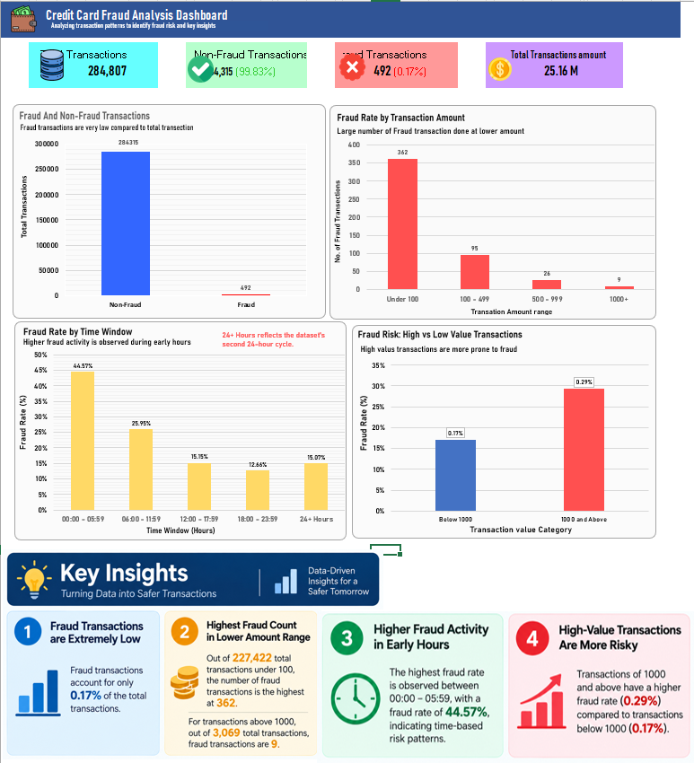

# Credit Card Fraud Detection — Risk & Transaction Analytics Project

## Objective
Analyze transaction data to identify patterns associated with fraud, and build 
classification models to detect fraudulent transactions — combining SQL-based 
exploratory analysis, an Excel dashboard, and machine learning models.

## Dataset
[Kaggle Credit Card Fraud Detection dataset](https://www.kaggle.com/datasets/mlg-ulb/creditcardfraud) — 284,807 transactions, 
492 labeled as fraud (0.17%). Features V1-V28 are PCA-transformed for privacy; 
Time and Amount are the only original, interpretable features.

## Approach
1. **SQL Analysis** — queried fraud rate, transaction patterns by time and 
   amount range (see `/sql/queries.sql`)
2. **Excel Dashboard** — visualized findings with KPI summary and charts 
   (see `/dashboard/dashboard.png`)
3. **Machine Learning** — trained and compared Logistic Regression and 
   Random Forest classifiers (see `/notebook/credit_fraud_analysis.ipynb`)

## Key Findings
- Fraud rate: 0.17% of all transactions
- Fraud transactions average ₹122 vs ₹88 for legitimate transactions
- Higher-value transactions (≥₹1000) show a higher fraud rate (0.29%) than 
  lower-value ones (0.17%)
- Early morning hours (00:00-05:59) show the highest fraud rate

## Dashboard

## Model Results

**Default threshold (0.5):**
| Model | Precision (Fraud) | Recall (Fraud) | F1-Score |
|---|---|---|---|
| Logistic Regression (balanced) | 0.06 | 0.92 | 0.11 |
| Random Forest (balanced) | 0.27 | 0.89 | 0.41 |

**Random Forest — after threshold tuning:**
| Threshold | Precision (Fraud) | Recall (Fraud) | F1-Score |
|---|---|---|---|
| 0.5 (default) | 0.27 | 0.89 | 0.41 |
| 0.7 | 0.69 | 0.87 | 0.77 |
| 0.9 | 0.84 | 0.74 | 0.79 |

**Business Insight:** The default threshold produced high recall but very low 
precision, meaning excessive false alarms. Raising the decision threshold to 0.9 
improved precision to 0.84 while keeping recall reasonably high at 0.74 — a far 
more production-realistic balance, since a real fraud team can't act on a flood 
of false positives. This demonstrates that model selection alone isn't 
sufficient; tuning the decision threshold to match business cost tradeoffs 
(cost of missing fraud vs. cost of false alarms) is equally important.

## Tech Stack
Python, Pandas, Scikit-learn, SQL, Excel

## Future Improvements
- Try XGBoost/LightGBM for potentially better performance
- Use SMOTE for oversampling instead of class weighting
- Deploy as a simple API endpoint
